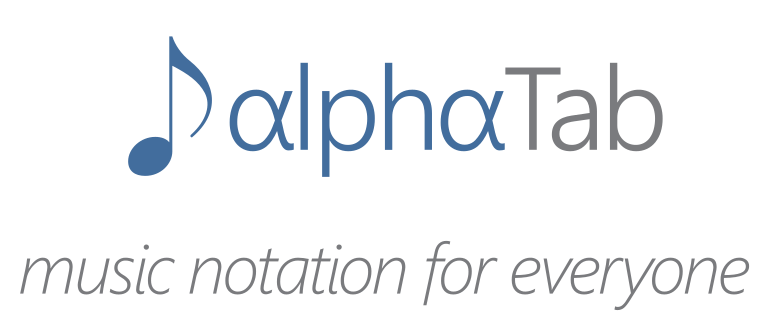

[](https://doi.org/10.5281/zenodo.18446852)
[](https://github.com/LIUBINfighter/Obsidian-Tab-Flow/actions/workflows/ci.yml)
[](https://github.com/LIUBINfighter/Obsidian-Tab-Flow/releases/latest)
[](https://deepwiki.com/LIUBINfighter/obsidian-tab-flow)

# Tab Flow

Render, play and write guitar tabs in Obsidian. Powered by [alphaTab](https://alphatab.net).


## Features

- Render and play Guitar Pro files (`.gp`, `.gp3`, `.gp4`, `.gp5`, `.gpx`).
    - Tab rendering, play/pause/stop, playback cursor, auto-scroll, dark mode.
    - Control components: tracks, layout, zoom, speed, count-in, metronome.
- Write scores in `alphaTex` (`.atex` files, or `alphatex` code blocks in notes) and share them.
    - Syntax highlighting (CodeMirror), Guitar Pro export, PNG share card, PDF export (work in progress).
- Built-in interactive documentation to learn and enjoy alphaTex.

### Custom playback experience


### Write guitar tabs like Markdown

`.atex` files:


`alphatex` code blocks in `.md` notes:


### Share your riff (beta)


### Learn alphaTex in the built-in playground


Open the documentation view from the command palette or the `guitar` ribbon icon:


## Requirements

- Obsidian 1.8.0 or later.
- Desktop only. The plugin bundles a web worker and uses Node APIs to load its local assets.

## Install

### 1. Obsidian community plugins

Once Tab Flow is available in the community directory: **Settings → Community plugins → Browse**, search for `Tab Flow`, then install and enable it.

### 2. BRAT (recommended while in review)

1. Install and enable the [BRAT](https://github.com/TfTHacker/obsidian42-brat) plugin.
2. In BRAT, choose **Add beta plugin** and enter:
    ```
    https://github.com/LIUBINfighter/Obsidian-Tab-Flow
    ```
3. Select a version and add the plugin.
4. Continue with **First run** below.

### 3. Manual install

1. Download `tab-flow.zip` (or `main.js`, `manifest.json`, `styles.css`) from the [latest release](https://github.com/LIUBINfighter/Obsidian-Tab-Flow/releases/latest).
2. Extract it into `<your vault>/.obsidian/plugins/tab-flow/`.
3. Reload Obsidian and enable **Tab Flow** in **Settings → Community plugins**.

## First run: download the playback assets

For security reasons, community plugins can't download files automatically. Tab Flow ships without the music font, soundfont and web worker; download them once from **Settings → Tab Flow → Asset management**:

1. Open **Settings → Tab Flow**.
2. In the **Asset management** tab, click **Download missing asset files** and wait for the download to finish.
3. Reload the plugin (or restart Obsidian).

The assets are fetched from the plugin's GitHub release, are stored inside the plugin folder, and are only used locally. See [Security and assets](#security-and-assets) below.

## Usage

- **Play a Guitar Pro file**: open any `.gp` / `.gp3` / `.gp4` / `.gp5` / `.gpx` file. Tab Flow renders the score and opens the player view.
- **Write a score**: create a `.atex` file, or add an `alphatex` code block to any note:
    ````
    ```alphatex
    \title "My riff"
    .
    :4 0.6 2.5 2.4 2.3 | 3.2 2.2 0.1 3.1
    ```
    ````
- **Learn alphaTex**: open the documentation view from the `guitar` ribbon icon (or the command palette) and edit the samples in the built-in playground.
- **Editor**: open the alphaTex editor from the command palette to write and preview side by side.
- **Print / PDF**: open the print preview from the player toolbar and use your system print dialog.

## Roadmap

- 0.5.x: player and editor polish (React + Zustand), alphaTab 1.8 support.
- 1.0.0: multimodal OCR for alphaTex and deeper score tooling.

More experiments live at [alphatab-vue](https://github.com/LIUBINfighter/alphatab-vue).

## Contributing

Thanks for using Tab Flow! Contributions are welcome:

- Feature requests and bugs: please open an issue.
- Pull requests: start a discussion or issue first so we can align on the approach.

## Inspired by

[alphaTab.js](https://alphatab.net), Bocchi the Rock!, Girls' Band Cry.

## Security and assets

Tab Flow downloads its runtime assets (music font, soundfont, web worker) from the plugin's GitHub release only when you ask it to, and keeps them inside the plugin folder. No telemetry, no remote code execution, no network access at runtime beyond loading those local files.

## Disclaimer

Please keep backups of your Guitar Pro files. Tab Flow doesn't rewrite your `.gp` files, but some scores render imperfectly because of CJK text encoding differences.

## Copyright & Credit

Copyright (c) 2025 Jay Bridge and other contributors. All rights reserved.

Licensed under the MPL 2.0 License.


## Special thanks to


