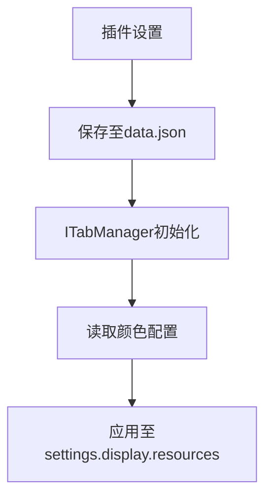

# 从运行时推断转向配置驱动的主题方案

## 两种着色方案分析

### 方案一：CSS变量（推荐方案）
- **适用对象**：AlphaTab播放器相关HTML控件（播放/暂停按钮、进度条等）
- **实现原理**：直接使用Obsidian的CSS变量替换样式
- **优势**：不涉及插件内部样式推断，完全由浏览器/Electron CSS引擎处理

```css
/* styles.css */
.at-controls button {
  background-color: var(--interactive-normal);
  border: 1px solid var(--background-modifier-border);
  color: var(--text-normal);
}

.at-controls button:hover {
  background-color: var(--interactive-hover);
}
```

参考文档：[AlphaTab播放器样式指南](https://www.alphatab.net/docs/guides/styling-player)

### 方案二：AlphaTab API（问题方案）
- **适用对象**：乐谱SVG渲染元素（音符、谱线等）
- **技术难点**：在伪装浏览器环境中进行CSS推断
- **实现流程**：
  1. 运行时获取CSS变量值
  2. 转换为AlphaTab Color对象
  3. 通过API应用到乐谱元素

```ts
const accentColor = getComputedStyle(document.body)
  .getPropertyValue('--text-accent')
  .trim();
  
const customColor = alphaTab.model.Color.fromJson(accentColor);

note.style.colors.set(
  alphaTab.model.NoteSubElement.StandardNotationNoteHead,
  customColor
);
```

## 核心问题：环境Hack冲突

### 问题重现
```ts
// 测试代码：硬编码红色音符
for (const track of score.tracks) {
  for (const staff of track.staves) {
    // ...嵌套循环至音符层级
    for (const note of beat.notes) {
      note.style = new alphaTab.model.NoteStyle();
      const customColor = alphaTab.model.Color.fromJson("#FF0000");
      note.style.colors.set(/*...*/, customColor);
    }
  }
}
```
✅ 测试成功：所有音符变为红色

### 问题触发
```ts
// 替换为动态获取CSS变量
const accentColor = getComputedStyle(document.body) // 此处引发崩溃
  .getPropertyValue('--text-accent').trim();
```
❌ 产生错误日志：
```log
Uncaught TypeError: Cannot read properties of undefined (reading 'listenerCount')
app.js:1 Uncaught (in promise) TypeError: Cannot read properties of undefined (reading 'platform')
```

### 根本原因
1. **环境伪装**：初始化AlphaTabApi时设置`process = undefined`模拟浏览器环境
2. **上下文污染**：API调用处于不稳定执行上下文
3. **DOM API冲突**：`getComputedStyle`触发Electron底层未知异常
4. **错误掩盖**：原始异常被顶层错误处理程序错误报告

## 解决方案：配置驱动架构

### 方案优势
- 避免运行时CSS推断
- 消除环境Hack的不稳定性
- 提供用户可配置接口

### 实现方案


### 关键实现点
1. **持久化配置**：亮色/暗色主题设置保存至Obsidian的data.json
2. **设置UI**：提供主题选择与颜色自定义界面
3. **静态加载**：直接从插件设置读取配置，避免运行时推断
